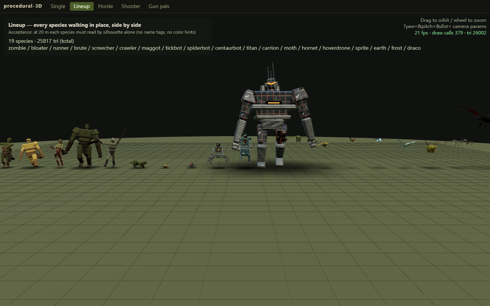
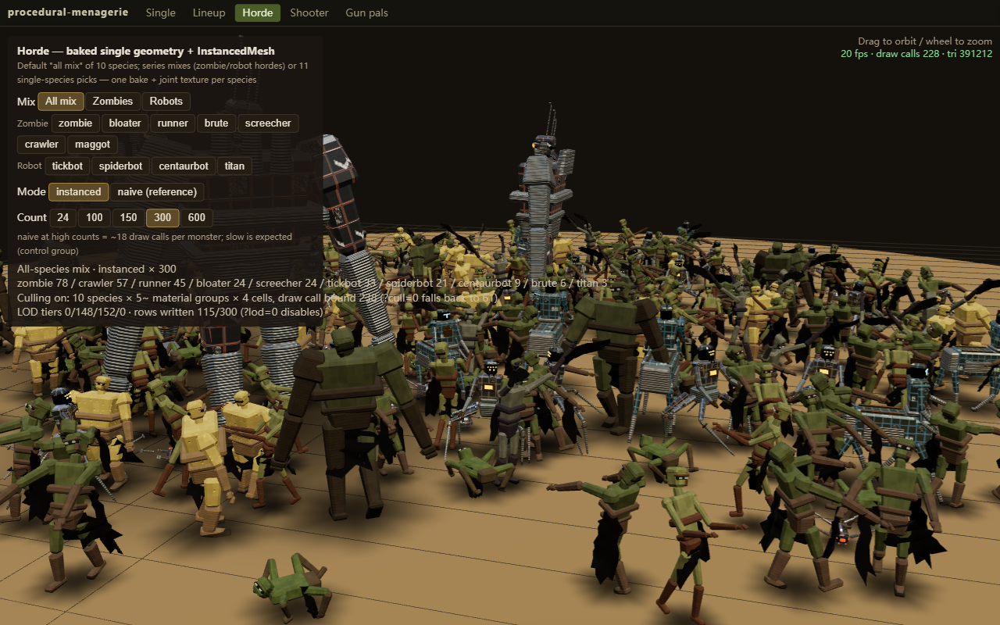
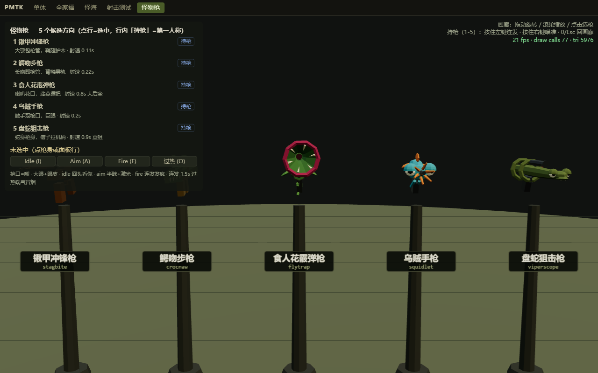
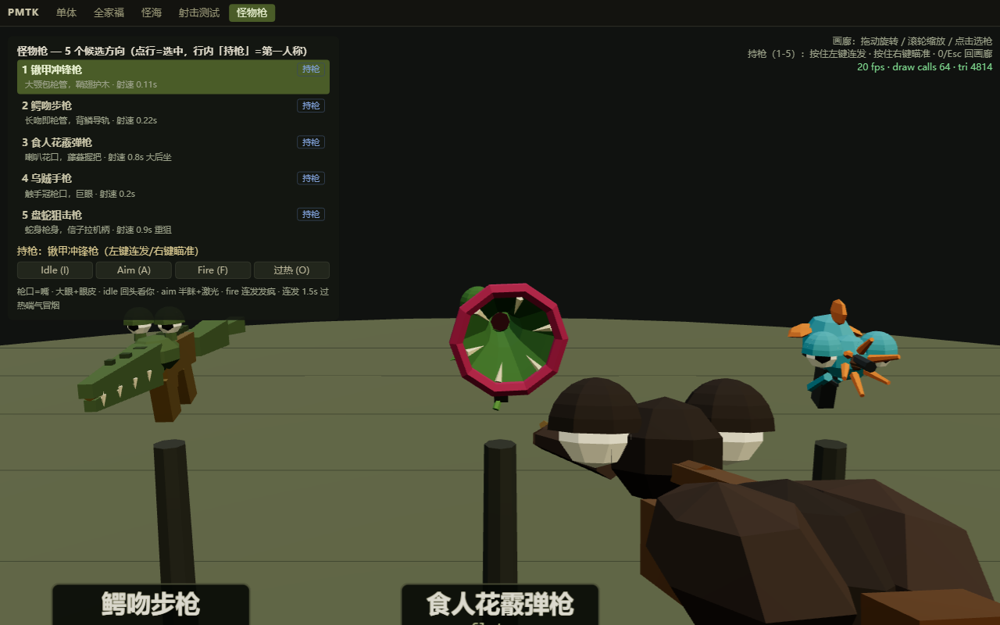
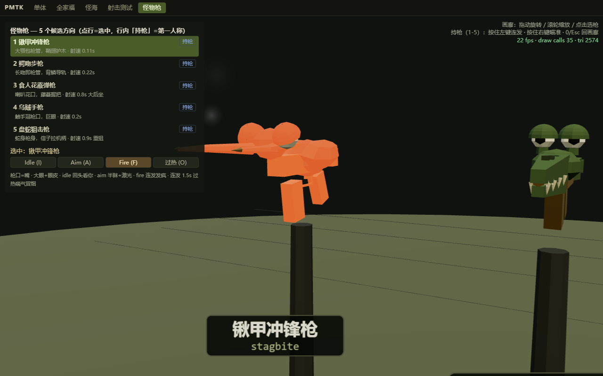
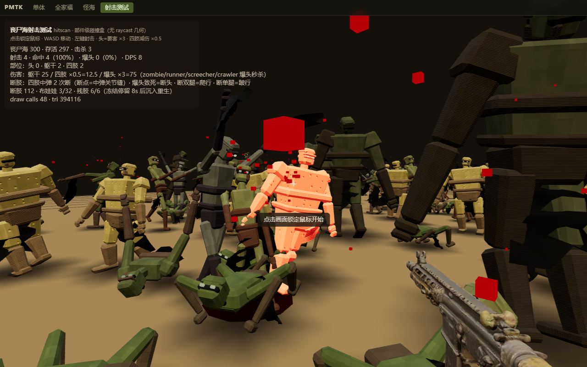

# procedural-3D

**Zero-asset, spec-driven procedural monsters — and living creature-weapons — for three.js.**

**[▶ Live demos](https://momeo.github.io/procedural-3D/examples/)** — five interactive pages, no install, runs entirely in the browser.

Everything is generated in code: geometry, textures, materials, animation. No model files,
no texture files, no build step — plain ES modules with a single peer dependency (`three`).

- **11 built-in species** (7 zombies — including the quadruped crawler and the limbless maggot — and 4 robots) driven by pure-data specs
  (palette / proportions / gait) — a new monster is a new table, not new machinery.
- **Horde instancing pipeline**: bake any species rig into one geometry per material and
  render hundreds of animated instances at a fixed draw-call budget — 300 mixed monsters
  in ~40–60 draw calls, independent of headcount.
- **Combat-ready**: per-part OBB hit volumes (head ×3 / limbs ×0.5), dismemberment via
  vertex-collapse masks, and hand-rolled Verlet ragdoll deaths — no physics engine.
- **5 gun pals**: living weapons (muzzle = mouth) with blinking eyes, look-back behavior
  and a four-state idle/aim/fire/overheat actor.

> Note: code comments are currently in Chinese (the library was developed in a
> Chinese-language repo). Entry files carry English docstrings; PRs translating
> comments are welcome.

## Screenshots

| | |
|---|---|
|  |  |
| All 11 species, silhouette check | 300 monsters, one batch per species |
|  |  |
| Gun pal gallery | First-person hold (stagbite) |
|  |  |
| Overheat: smoke + heat glow | Dismemberment + Verlet ragdolls |

## Quick start

The library is plain ESM. Give the page an importmap entry for `three` (>= 0.170;
r170 is vendored under `examples/vendor/` so the examples run fully offline):

```html
<script type="importmap">
{"imports":{"three":"./examples/vendor/three.module.js"}}
</script>
<script type="module">
import * as THREE from 'three';
import { SPECIES, strideRate } from './src/index.js';

const { spec, factory } = SPECIES.zombie;
const actor = factory(spec, 0);              // deterministic: same (id, index) → same monster
actor.rig.group.scale.setScalar(actor.scale);
scene.add(actor.rig.group);

// per frame:
actor.st.phase += dt * strideRate(spec, actor.rig, spec.speed);
spec.animate(actor.rig, spec, {
  phase: actor.st.phase, speed: spec.speed, windup: 0, strike: 0,
  stagger: 0, staggerRoll: 0, staggerPitch: 0,
  hit: 0, hitLX: 0, hitLY: 0.55, hitF: 0, hitS: 0, hitHead: 0,
});
</script>
```

A gun pal is three lines:

```js
import { buildGun } from './src/index.js';
const gun = buildGun('stagbite');            // or crocmaw / flytrap / squidlet / viperscope
scene.add(gun.group);
// per frame: gun.update(dt, camera);  input: gun.actor.requestState('fire');
```

## Examples

Hosted online at **https://momeo.github.io/procedural-3D/examples/** (GitHub Pages, straight from this repo).
Or serve the repository root over HTTP (`python -m http.server`) and open `examples/`
— the landing page links all five demos.

| Page | What it shows | Test hook |
|------|---------------|-----------|
| `examples/single.html` | Single monster viewer: species switcher, attack/stagger triggers, hit-volume overlay (`?vol=1`) | `window.__pmtk` |
| `examples/lineup.html` | All 11 species side by side — silhouette readability check | `window.__pmtk` |
| `examples/horde.html` | Horde instancing: mixes & single species, 24–600 instances, `?lod=0` / `?cull=0` A/B toggles | `window.__horde` |
| `examples/shooter.html` | FPS hitscan playground: OBB part hits, dismemberment, ragdolls, blood pools | `window.__shooter` |
| `examples/gunpals.html` | Gun pal gallery + first-person hold (keys 1–5, I/A/F/O states) | `window.__pmtk` |

## Architecture

Four layers, each depending only on the ones below it:

- **`src/core/`** — the generic machine: `buildHumanoid` / `animateHumanoid` /
  `strideRate`, originally derived from sands-of-the-restless (MIT) — see NOTICE.
  A spec-fed builder assembles a rig of nested `Group` joints with rigid box parts;
  the animator writes joint Euler angles every frame. Do not modify this layer.
- **`src/` (pipeline)** — the horde machinery: `bake.js` flattens a rig in bind pose into
  one geometry per material with per-vertex joint ids (and, for free, per-part hit boxes);
  `gait.js` re-implements the walk/attack/stagger formulas in pure JS and writes joint
  quaternions into a `RGBA32F` `DataTexture`; a small vertex-shader patch re-poses each
  instance on the GPU. Also here: `rng.js` (seeded determinism — one `?seed=` reproduces
  a run bit-for-bit), `prims.js` (curved primitives: cyl / ellipsoid / lathe),
  `lod.js` (distance-tiered animation + 2×2 grid frustum culling), `hitvol.js`
  (per-part OBB raycasting — hit tests read the same joint texture the renderer uses),
  `ragdoll.js` (14-point Verlet ragdoll writing back into the joint texture).
- **`src/species/`** — data, not code: each species is a spec table
  (`palette` / `proportions` / `gait`) plus optional procedural texture functions and a
  factory. `src/species/index.js` is the registry — one line per species.
- **`src/gunpals/`** — the living weapons: five builders on a shared behavior actor
  (four states, eye/eyelid system, muzzle flash/tracer/laser/smoke), sharing `prims.js`
  with the monster pipeline.

## Writing a new species

A new monster = a new spec. Copy `src/species/zombie.js`, tune the three tables, register
one line in `src/species/index.js`, and it appears in the viewer, the lineup, the horde
and the shooter with hit volumes, dismemberment and ragdoll already working. Silhouette
first: at 20 m the outline is the only thing a player reads — tune `proportions` before
textures, and respect the one iron rule `hipY = thighL + shinL` (or the feet float).

The full AI-assisted workflow — from a one-sentence creature description to a merged
spec — lives in **[`skill/SKILL.md`](skill/SKILL.md)** (a drop-in skill for coding
agents, with the spec field contracts and the pitfalls that bite).

## Performance budgets

Measured with headless SwiftShader (software GL) — the numbers that matter here are
draw calls and texture writes, not fps. Single monster ≈ 1.2k triangles, 14 joints.

| Scenario | Draw calls |
|----------|-----------|
| Naive reference (per-actor `Group`s), 100 monsters | 1803 |
| Instanced single species, 100 / 300 / 600 monsters | **8** (6 material groups + ground + grid) |
| Species lineup, all 11 species walking side by side | **221** calls / 15.7k tris total |
| Mixed horde, 7 zombie species × 300 | **43** |
| Mixed horde, 4 robot species × 300 | **25** |
| Mixed horde, all 10 mix species × 300 | **61** |
| Shooter (horde + viewmodel + blood/decal pools), 300 | **42** (peak ≤ 48 with debris + ragdolls) |
| Distance-tiered LOD animation | 115/300 joint-texture rows written at default camera; 0/300 from 55 m |
| 2×2 grid frustum culling (camera facing away) | 228 → **55** calls, 390k → 89k tris |

Gun pals average ~1.1k triangles each, pure geometry (zero textures).

## Roadmap

- npm package publish (the layout is already `package.json`-ready)
- English translation of in-code comments (help wanted)
- WebXR example (the gun pals were designed for VR first-person hold)

## License & attribution

MIT © Momeo — see [LICENSE](LICENSE).

`src/core/` contains third-party MIT-licensed engine code — attribution lives in
[NOTICE](NOTICE). Everything else is original work.
three.js (r170, MIT) is vendored in `examples/vendor/` for offline demos.
